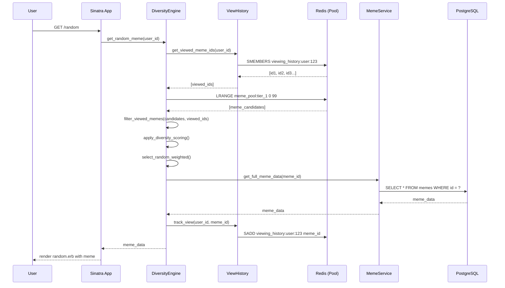
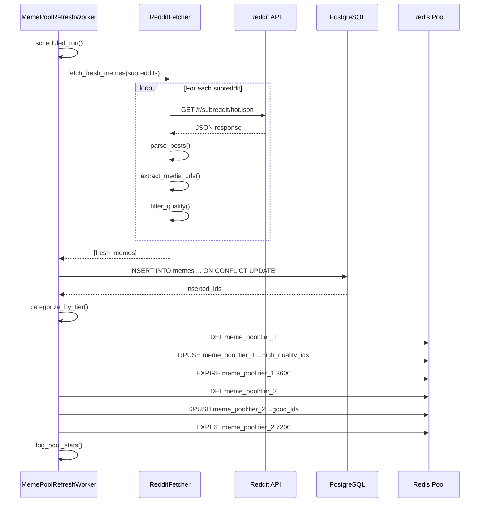

# Meme Explorer Architecture Diagram

## High-Level System Architecture

```mermaid
graph TB
    User[👤 User Browser]
    
    subgraph "Frontend Layer"
        Layout[Layout.erb]
        Random[Random Meme Page]
        Trending[Trending Page]
        Profile[Profile Page]
        JS[JavaScript Modules]
    end
    
    subgraph "Application Layer - Sinatra"
        App[app.rb]
        
        subgraph "Route Handlers"
            RandomRoutes[/random]
            TrendingRoutes[/trending]
            ProfileRoutes[/profile]
            APIRoutes[/api/*]
            AuthRoutes[/auth/*]
        end
        
        subgraph "Middleware Stack"
            Security[Security Headers]
            CSRF[CSRF Protection]
            Session[Session Management]
            RateLimit[Rate Limiting]
            Perf[Performance Monitor]
        end
    end
    
    subgraph "Service Layer"
        MemeService[MemeService]
        DiversityEngine[DiversityEngineService]
        RedditFetcher[RedditFetcherService]
        TurboFetcher[TurbochargedRedditFetcher]
        CacheService[CacheService]
        ViewHistory[ViewingHistoryService]
        TasteProfile[TasteProfileService]
        AuthService[AuthService]
    end
    
    subgraph "Background Workers - Sidekiq"
        PoolRefresh[MemePoolRefreshWorker]
        CachePreload[CachePreloadWorker]
        Cleanup[DatabaseCleanupWorker]
        Health[HealthCheckWorker]
    end
    
    subgraph "Data Layer"
        DB[(PostgreSQL)]
        Redis[(Redis)]
        
        subgraph "Redis Keys"
            MemePool[Meme Pool]
            ViewedMemes[Viewed History]
            Cache[Response Cache]
            Sessions[User Sessions]
        end
    end
    
    subgraph "External APIs"
        RedditAPI[Reddit API]
        ImgurAPI[Imgur API]
    end
    
    User -->|HTTP Request| Layout
    Layout --> Random
    Layout --> Trending
    Layout --> Profile
    
    Random --> RandomRoutes
    Trending --> TrendingRoutes
    Profile --> ProfileRoutes
    
    RandomRoutes --> Middleware Stack
    TrendingRoutes --> Middleware Stack
    ProfileRoutes --> Middleware Stack
    APIRoutes --> Middleware Stack
    
    Security --> App
    CSRF --> Security
    Session --> CSRF
    RateLimit --> Session
    Perf --> RateLimit
    
    App --> MemeService
    App --> DiversityEngine
    App --> AuthService
    
    MemeService --> RedditFetcher
    MemeService --> CacheService
    DiversityEngine --> ViewHistory
    DiversityEngine --> TasteProfile
    
    RedditFetcher --> TurboFetcher
    TurboFetcher -->|Fetch Posts| RedditAPI
    TurboFetcher -->|Parse Media| ImgurAPI
    
    MemeService -->|Read/Write| DB
    CacheService -->|Get/Set| Redis
    ViewHistory -->|Track| Redis
    
    PoolRefresh -->|Populate| Redis
    PoolRefresh -->|Fetch| RedditFetcher
    CachePreload -->|Warm| Cache
    Cleanup -->|Prune| DB
    Health -->|Monitor| Redis
    
    style User fill:#e1f5ff
    style DB fill:#f9f
    style Redis fill:#f66
    style RedditAPI fill:#ff6a00
    style App fill:#90EE90
```

## Data Flow Diagrams

### Random Meme Request Flow



### Background Pool Refresh Flow



## Component Responsibilities

### Frontend Components
- **layout.erb**: Base template, nav, meta tags, AdSense
- **random.erb**: Random meme discovery interface
- **meme-interactions.js**: Like, share, save functionality
- **meme-navigation.js**: Next/previous meme controls

### Service Components
- **MemeService**: Core meme CRUD operations
- **DiversityEngineService**: Anti-repetition algorithm
- **RedditFetcherService**: Reddit API integration
- **CacheService**: Redis caching abstraction
- **ViewingHistoryService**: User view tracking

### Background Workers
- **MemePoolRefreshWorker**: Maintains fresh meme pool
- **CachePreloadWorker**: Warms response caches
- **DatabaseCleanupWorker**: Prunes old data
- **HealthCheckWorker**: System health monitoring

## Technology Stack

- **Web Framework**: Sinatra 3.x
- **Database**: PostgreSQL 14+
- **Cache/Queue**: Redis 7+
- **Background Jobs**: Sidekiq
- **Frontend**: Vanilla JS (ES6+), CSS3
- **Testing**: RSpec, Rack::Test
- **Deployment**: Render.com
